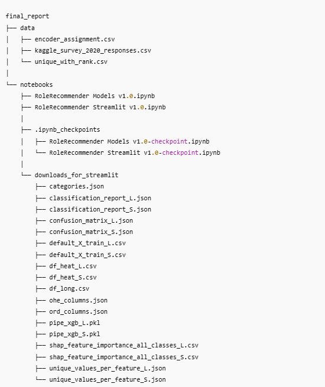
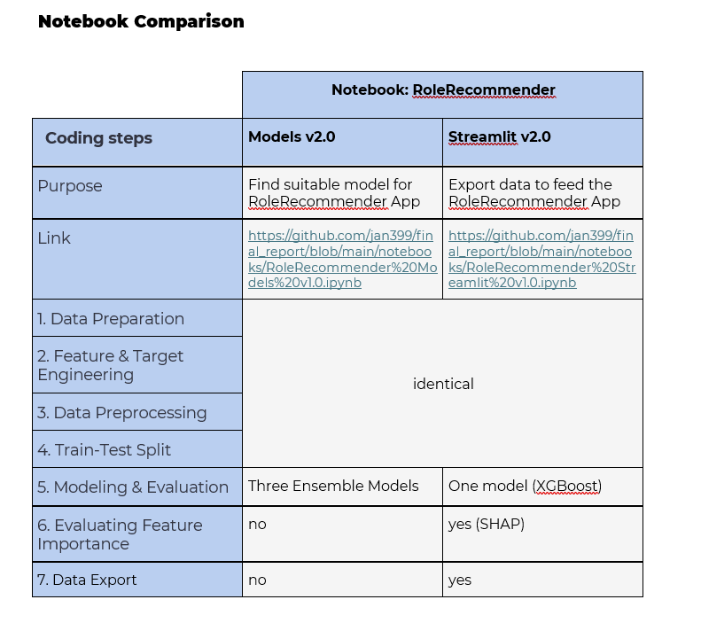

# Final Report

This directory contains two Jupyter notebooks that were used to develop and prepare the **RoleRecommender App**:

- **RoleRecommender Models v2.0.ipynb** – Trains and evaluates three ensemble models (RandomForest, HistGradientBoosting, and XGBoost).
- **RoleRecommender Streamlit v2.0.ipynb** – Generates all files required to run the RoleRecommender App on Streamlit.

---

## Demo

You can try the app online here:  
[**RoleRecommender Online**](https://w9v3uossaz4zuzqyfzufvp.streamlit.app/)

---

## Directory Structure

## Purpose of Notebooks

---

## Important Notes

- Files in the `downloads_for_streamlit` folder must be **manually copied** to the app's upload directory.  
- This extra step was intentionally chosen to ensure **stable and consistent app performance**.  
- **Before generating new files, all existing files in this folder must be deleted** to avoid conflicts.
